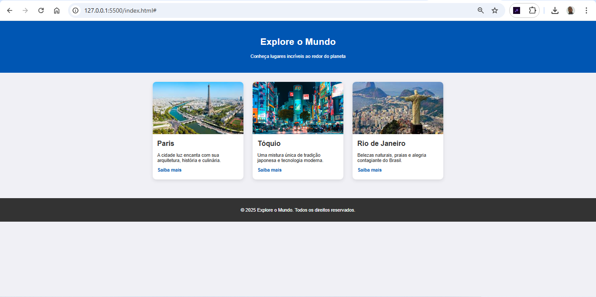

# Página de Destinos Turísticos

Projeto de página estática criado com **HTML5** e **CSS3**, apresentando três destinos turísticos populares ao redor do mundo. O foco deste projeto é demonstrar habilidades com layout responsivo, grid e design visual agradável.

## 🌍 Objetivo

Exibir destinos turísticos com imagens, títulos, descrições e links, utilizando estrutura semântica e boas práticas de estilização.

## 🖼️ Preview



## 🛠️ Tecnologias Utilizadas

- HTML5
- CSS3

## 💡 Funcionalidades

- Layout responsivo com Grid
- Efeitos de hover
- Organização visual de cards
- Design adaptado para desktop e mobile

## 📂 Estrutura de Arquivos

destinos-turisticos/
├── index.html
├── style.css
└── images/
├── paris.jpg
├── tokyo.jpg
└── rio.jpg

## 📬 Contato

Email: heloiltonsl@gmail.com

LinkedIn: www.linkedin.com/in/heloilton-souza-laurentino-b0464b34a


## 🚀 Como Executar

1. Clone o repositório:
   ```bash
   git clone https://github.com/heloysouza/destinos-turisticos.git
